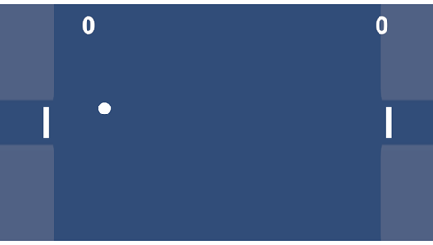

# Tennis

### Pong のようにラケットで球を打ち合うゲームです。

#### ルール

* 失敗すると相手に10点が加算されます。
* 先に100点を取ったプレーヤーが勝ちになります。

#### 操作方法

(PCの場合)
* プレーヤーAのラケットは、[Q]と[Z]で操作します。
* プレーヤーBのラケットは、[O]と[M]で操作します。
* 難易度は[↑]、[↓]で選択します。
* [ESC]で終了、[Enter]で決定します。

(モバイルの場合)
* 半透明のボタンをタップすることでラケットの移動や難易度の選択ができます。
* 画面中央をタップすることで決定します。

#### thanks

[効果音ラボ](https://soundeffect-lab.info/)
